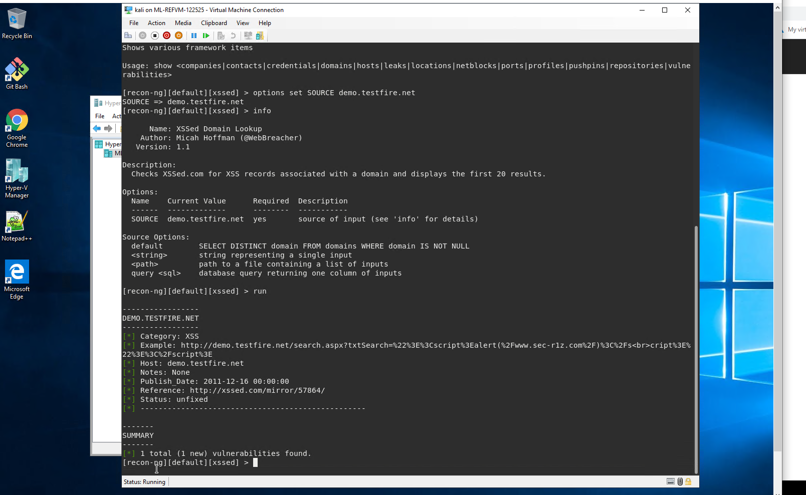

## Step 1: Google Dorking

Using Google, can you identify who the Chief Executive Officer of Altoro Mutual is:
    
        ### Answer
    - Karl Fitzgerald

How can this information be helpful to an attacker:

    ### Answer
    - Enabling an attacker to launch an EMAIL whaling phising attack against the CEO of Altoro Mutual

## Step 2: DNS and Domain Discovery

Enter the IP address for demo.testfire.net into Domain Dossier and answer the following questions based on the results:

Where is the company located:

    ### Answer
    - Sunnyvalle, CA

What is the NetRange IP address:

    ### Answer
    - 65.61.137.64 - 65.61.137.127

What is the company they use to store their infrastructure:

    ### Answer
    - Rackspace Backbone Engineering

What is the IP address of the DNS server:

    ### Answer
    - 65.61.137.117

## Step 3: Shodan

What open ports and running services did Shodan find:

    ### Answer
    - Port 80 - Apache tcp, HTTP
    - Port 443 - Apache tcp, HTTPS
    - Port 8080 - Apache tcp, HTTPS

Step 4: Recon-ng

Install the Recon module xssed.
Set the source to demo.testfire.net.
Run the module.

Is Altoro Mutual vulnerable to XSS:
  
  ### Answer
    - YES

## Step 5: Zenmap

Your client has asked that you help identify any vulnerabilities with their file-sharing server. Using the Metasploitable machine to act as your client's server, complete the following:

Command for Zenmap to run a service scan against the Metasploitable machine:

 ### Answer
    - nmap -T4 -A -v 192.168.0.10 -o metasploitable.nmap
   
Bonus command to output results into a new text file named zenmapscan.txt:

    ### Answer
    - nmap -sV -oN zenmapscan.txt

Zenmap vulnerability script command:

    ### Answer
    - nmap -T4 -A -v --script vulners -p 139,445 192.168.0.10 -o metasploitable.nmap

  
Once you have identified this vulnerability, answer the following questions for your client:

What is the vulnerability:

    ### Answer
    - The 192.168.0.10\tmp fileshare allows for user Anonymous: READ/WRITE access

Why is it dangerous:

    ### Answer
    - This could result in a hacker gaining access to the host server and install malicious code 

What mitigation strategies can you recommendations for the client to protect their server:

    ### Answer
    - Keep Software Up-to-Date.
    - Install Anti-Virus Protection Software.
    - Back Up Critical Data.
    - Invest in Security Training for Employees. 
    - Secure Your Infrastructure. 
    - Implement Multi-Factor Authentication.
    - Identify Threats, Make a Plan, and Learn from Mistakes.

